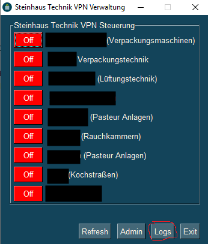
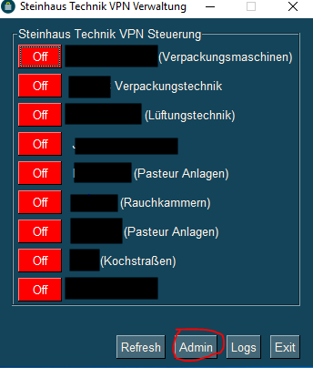
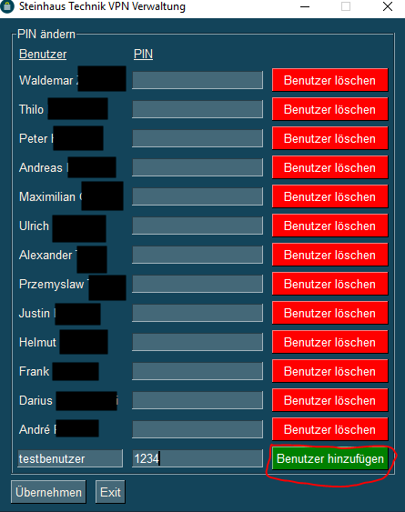

# Sophos_VPN_Steuerung
Steuerung von Fernzugriffen mittels Python Tool (Sowohl Sophos User als auch Regeln)

## Wichtige Infos

- Benutzer Pins können bei bedarf mehr als 4-Stellige Pins haben
- Logs können durch die EDV-Abteilung eingesehen werden
- Logs können durch die EDV-Abteilung zurückgesetzt werden
- Neue Firmen können und sollten nur durch die EDV hinzugefügt werden
- Pins von Benutzern dürfen aufkeinenfall weitergesagt werden
- Sollten ein Neuer Benutzer benötigt werden wird dies nur vom zuständigen Administrator getan
- Das Administrator Passwort darf niemals Digital vorliegen (Optimalerweise auch nicht Physikalisch)

## Ferwartungssteuerung durch Benutzer

### Initial Maske

Startet man das Programm wird man mit der Firmen Ansicht konfrontiert.

Firmen mit einem roten Button haben momentan keinen Zugriff auf das Netzwerk.
Firmen mit einem grünen Button haben Zugriff.

### Firmen zuschalten

Möchte der Benutzer eine Firma zuschalten, tut er dies mit der betätigung des roten Buttons mit dem Lable _Off_.
Darauf hin bekommt er ein Popup indem er aufgefordert wird seinen *benutzerspezifischen Pin* einzugeben.

Die eingabe seines Pins bestätigt er mit dem Button _OK_.
Nun sollte die Firma einen grünen Button haben mit dem Lable _ON_.

### Firmen abschalten

Möchte der Benutzer eine Firma zuschalten, tut er dies mit der betätigung des roten Buttons mit dem Lable _ON_.
Darauf hin bekommt er ein Popup indem er aufgefordert wird seinen *benutzerspezifischen Pin* einzugeben.

Die eingabe seines Pins bestätigt er mit dem Button _OK_.
Nun sollte die Firma einen roten Button haben mit dem Lable _OFF_.

## Nachverfolgbarkeit

Die Nachverfolgbarkeit von Zu- und Abschaltungen ist gewährt durch ein Logging von allen Aktionen.
Um diese Logs einzusehen bietet die Oberfläche einen Button _Logs_.

Daraufhin öffnet sich ein neues Fenster mit allen wichtigen Informationen.

Einträge die länger zurück liegen und somit obsolet sind können durch die EDV-Abteilung entfernt werden (eigentlich nicht nötig).

## Benutzersteuerung

### Benutzer anlegen

Um einen neuen Benutzer anzulegen, muss zunächst die Admin-Steuerung geöffnet werden.

Mit dem Klick auf den Button Admin erscheint folgende Maske

Hier muss nun die eingabe des _Admin Passworts_ erfolgen (längerer Schlüssel).
Mit dem Klick auf OK gelangt der Administrator dann in die Benutzersteuerung.
Hier kann der Administrator im unteren Bereich einen neuen Benutzer anlegen,
dies geschieht mit einem Namen und einem 4-Stelligen Pin.

Hier Beispielhaft mit dem Benutzer testbenutzer mit dem Pin 1234
Diese Aktion dann bestätigen mit dem Button _Benutzer hinzufügen_

### Benutzer löschen

Um einen bestehenden Benutzer zu löschen, muss zunächst die Admin-Steuerung geöffnet werden.

Mit dem Klick auf den Button Admin erscheint folgende Maske

Hier muss nun die eingabe des _Admin Passworts_ erfolgen (längerer Schlüssel).
Mit dem Klick auf OK gelangt der Administrator dann in die Benutzersteuerung.
Hier kann der Administrator den bestehenden Benutzer löschen indem er den Button _Benutzer löschen_ betätigt.

### Benutzer Pins ändern

Um einen bestehenden Benutzer zu löschen, muss zunächst die Admin-Steuerung geöffnet werden.

Mit dem Klick auf den Button Admin erscheint folgende Maske

Hier muss nun die eingabe des _Admin Passworts_ erfolgen (längerer Schlüssel).
Mit dem Klick auf OK gelangt der Administrator dann in die Benutzersteuerung.
Hier kann der Administrator den Pin eines bestehenden Benutzers ändern indem er ihn neu eintippt.

Bestätigt werden muss das ganze mit dem Button _Übernehmen_
